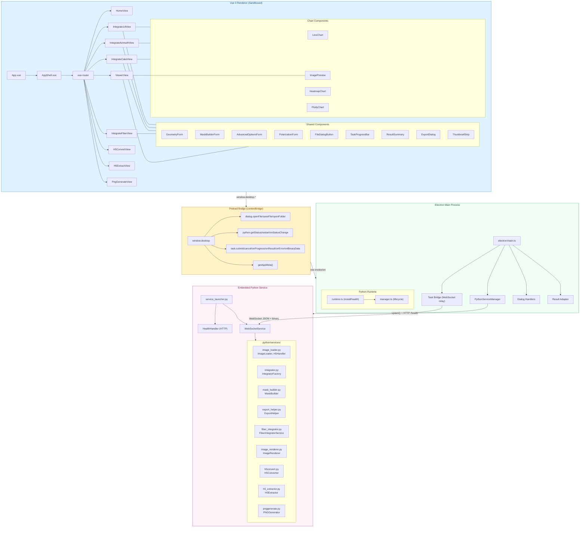
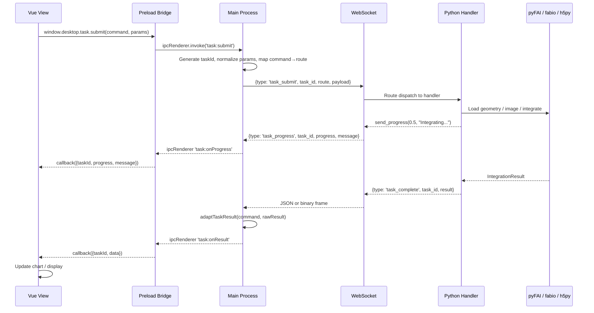

# Architecture — WAXS-SAXS Manager Electron Desktop App

> **WAXS-SAXS Manager** is an Electron + Vue 3 desktop application for X-ray diffraction (XRD/WAXS/SAXS/GIWAXS) data processing. It embeds a Python runtime (pyFAI-based) as a child process, communicating via WebSocket for task execution and HTTP for health monitoring.

---

## Table of Contents

1. [System Overview](#system-overview)
2. [Architecture Diagram](#architecture-diagram)
3. [Functional Areas](#functional-areas)
4. [Key Execution Flows](#key-execution-flows)
5. [Directory Structure](#directory-structure)
6. [Technology Stack](#technology-stack)

---

## System Overview

The application follows a **three-tier architecture** inside a single Electron window:

```
┌─────────────────────────────────────────────────────────────────────┐
│                        Electron BrowserWindow                       │
│                                                                     │
│  ┌───────────────────────────────────────────────────────────────┐  │
│  │                    Vue 3 Renderer Process                     │  │
│  │  (Sandboxed, Context Isolation ON, No Node Integration)      │  │
│  │                                                               │  │
│  │  App.vue → AppShell.vue → <router-view>                      │  │
│  │    ├── HomeView          (landing page)                       │  │
│  │    ├── Integrate1dView   (1D radial integration)              │  │
│  │    ├── IntegrateAzimuthView (χ integration)                   │  │
│  │    ├── IntegrateCakeView (CAKE sector integration)            │  │
│  │    ├── IntegrateFiberView (GIWAXS q_ip×q_oop)                │  │
│  │    ├── ViewerView        (image viewer + PNG export)          │  │
│  │    ├── H5ConvertView     (HDF5 format conversion)             │  │
│  │    ├── H5ExtractView     (HDF5 data extraction)               │  │
│  │    └── PngGenerateView   (batch PNG generation)               │  │
│  └───────────────────────────────────────────────────────────────┘  │
│          │                    ▲                                      │
│          │ window.desktop      │ IPC events                         │
│          │ (preload bridge)    │ (task:onProgress/Result/Error)     │
│          ▼                    │                                      │
│  ┌───────────────────────────────────────────────────────────────┐  │
│  │                Electron Main Process (Node.js)                │  │
│  │                                                               │  │
│  │  electron/main.ts                                            │  │
│  │    ├── BrowserWindow lifecycle                               │  │
│  │    ├── IPC handlers (dialog, appMeta, python status)          │  │
│  │    ├── PythonServiceManager (child process lifecycle)         │  │
│  │    ├── Task Bridge (WebSocket ↔ IPC relay)                   │  │
│  │    └── Result adaptation (normalize Python → Vue shapes)      │  │
│  └───────────────────────────────────────────────────────────────┘  │
│          │                     ▲                                     │
│          │ spawn()              │ WebSocket (JSON + binary frames)  │
│          │ stdout/stderr        │ HTTP GET /health                   │
│          ▼                     │                                     │
│  ┌───────────────────────────────────────────────────────────────┐  │
│  │               Embedded Python Runtime (child process)         │  │
│  │                                                               │  │
│  │  python/service_launcher.py                                  │  │
│  │    ├── HealthHandler (HTTP /health, /shutdown, /crash)        │  │
│  │    ├── WebSocketService (task routing, progress, cancel)      │  │
│  │    └── Route Handlers → python/services/*                    │  │
│  │          ├── integrator.py      (IntegratorFactory)           │  │
│  │          ├── image_loader.py    (ImageLoader, H5Handler)      │  │
│  │          ├── mask_builder.py    (MaskBuilder)                 │  │
│  │          ├── export_helper.py   (ExportHelper)                │  │
│  │          ├── fiber_integrator.py (FiberIntegratorService)     │  │
│  │          ├── image_renderer.py  (ImageRenderer)               │  │
│  │          ├── h5convert.py       (H5Converter)                 │  │
│  │          ├── h5_extractor.py    (H5Extractor)                 │  │
│  │          └── pnggenerate.py     (PNGGenerator)                │  │
│  └───────────────────────────────────────────────────────────────┘  │
└─────────────────────────────────────────────────────────────────────┘
```

### Design Principles

| Principle | Implementation |
|-----------|---------------|
| **Security** | `contextIsolation: true`, `sandbox: true`, `nodeIntegration: false`. All Node APIs accessed exclusively through preload bridge. |
| **Separation of Concerns** | Vue renderer has zero knowledge of Electron/Node. Main process has zero knowledge of Vue components. Python has zero knowledge of Electron. |
| **Async Task Lifecycle** | All heavy computation runs in Python. Results stream back via WebSocket with progress, cancellation, and binary frame support. |
| **Embedded Runtime** | Python 3.11.9 is installed alongside the app. Dependencies auto-installed from `requirements.lock.txt` with hash-based stamp validation. |

---

## Architecture Diagram



### Data Flow Diagram



---

## Functional Areas

### 1. Vue 3 Renderer (`src/`)

The renderer is a **fully sandboxed** Vue 3 SPA with no access to Node.js APIs.

| Module | Purpose |
|--------|---------|
| `main.ts` | App bootstrap: Vue + Router + i18n + Toast |
| `App.vue` | Root component wrapping `AppErrorBoundary` → `AppShell` |
| `layouts/AppShell.vue` | Global shell: header with brand, section indicator, Python status banner, locale switcher, `<router-view>` |
| `router/index.ts` | Hash-based routing with lazy-loaded views; meta keys for i18n title/description/section |
| `views/` | Page-level view components (one per route) |
| `components/business/` | Reusable domain components: `GeometryForm`, `MaskBuilderForm`, `AdvancedOptionsForm`, `PolarizationForm`, `FileDialogButton`, `TaskProgressBar`, `ResultSummary`, `ExportDialog`, `ThumbnailStrip` |
| `components/charts/` | Visualization components: `LineChart`, `HeatmapChart`, `ImagePreview`, `PlotlyChart` (wrapping Plotly.js) |
| `lib/` | Shared utilities: `chart-utils.ts`, `toast.ts`, `testIds.ts` |
| `i18n/` | vue-i18n setup with zh/en message bundles |
| `types/ipc.ts` | TypeScript types mirroring the Python WebSocket protocol exactly |
| `styles/` | Global CSS and CSS custom properties (`variables.css`) |

**Key Design**: Every view calls `window.desktop.task.submit()` which flows through preload → main process → Python. Views subscribe to `onProgress`, `onResult`, `onError`, and `onBinaryData` via the preload bridge.

### 2. Electron Main Process (`electron/`)

| File | Responsibility |
|------|---------------|
| `main.ts` | **Application entry** — BrowserWindow creation, IPC registration, Python lifecycle, task bridge orchestration |
| `preload.ts` | **Security boundary** — `contextBridge.exposeInMainWorld('desktop', ...)` exposing typed API surface |
| `constants.ts` | IPC channel name registry and app metadata |
| `python/manager.ts` | `PythonServiceManager` — child process spawn, port reservation, health polling, graceful shutdown |
| `python/runtime.ts` | `ensureEmbeddedPython()` — Python installer, pip dependency management, hash-based stamp validation |

**Main Process Core Responsibilities**:

1. **Window Lifecycle**: Creates the BrowserWindow with strict security settings
2. **Python Runtime Management**: Spawns embedded Python 3.11.9, monitors health via HTTP polling, handles crashes and restarts
3. **Native Dialogs**: Bridges `dialog.showOpenDialog` / `dialog.showSaveDialog` to the renderer
4. **Task Bridge**: Full-duplex WebSocket relay between renderer and Python:
   - **Submit**: Maps commands (`integrate1d`, `integrate_azimuth`, etc.) to API routes, normalizes parameters
   - **Progress**: Relays progress events from Python → renderer
   - **Result Adaptation**: Transforms raw Python results into renderer-friendly shapes (e.g., `integrate1d` → `[{radial, intensity, label}]`)
   - **Binary Frames**: Decodes custom binary protocol (4-byte header length + JSON header + PNG data) for image transmission
   - **Cancel**: Forwards cancellation signals to Python via WebSocket

### 3. Embedded Python Service (`python/`)

| File | Responsibility |
|------|---------------|
| `service_launcher.py` | **Service entrypoint** — HTTP health server + WebSocket task router + route handlers |
| `services/integrator.py` | `IntegratorFactory` — creates pyFAI `AzimuthalIntegrator` from PONI or manual params |
| `services/image_loader.py` | `ImageLoader` + `H5Handler` — loads EDF/TIFF/HDF5 (2D/3D/4D/Eiger) data |
| `services/mask_builder.py` | `MaskBuilder` — value-range masks, dead-pixel detection, custom mask merging |
| `services/export_helper.py` | `ExportHelper` + data classes — TXT/HDF5/TIFF/EDF/NPY export |
| `services/fiber_integrator.py` | `FiberIntegratorService` — GIWAXS q_ip × q_oop 2D integration |
| `services/image_renderer.py` | `ImageRenderer` — PNG rendering, thumbnails, contrast computation, colormap LUT |
| `services/h5convert.py` | `H5Converter` — HDF5 format conversion (scan → inspect → export) |
| `services/h5_extractor.py` | `H5Extractor` — HDF5 dataset extraction to individual files |
| `services/pnggenerate.py` | `PNGGenerator` — batch PNG generation from diffraction images |
| `services/colormaps.py` | Colormap definitions for image rendering |

**Service Architecture**:

```
service_launcher.py
├── HTTP Server (ThreadingHTTPServer)
│   ├── GET  /health   → HealthHandler.do_GET
│   ├── POST /shutdown → Graceful shutdown
│   └── POST /crash    → Forced crash (dev/test only)
│
└── WebSocket Server (websockets library, port = HTTP_port + 1)
    ├── task_submit  → Route dispatch → handler(payload, send_progress, cancel_event)
    ├── task_cancel  → Set asyncio.Event on running task
    └── Responses:
        ├── task_accepted  (JSON)
        ├── task_progress  (JSON, streamed)
        ├── task_complete  (JSON or binary frame)
        ├── task_error     (JSON)
        └── task_cancelled (JSON)
```

**Lazy Import System**: All heavy scientific modules (numpy, pyFAI, fabio) are wrapped in `_LazyImportProxy` to keep the health-check path fast. The actual imports only trigger when a route handler accesses them.

---

## Key Execution Flows

### Flow 1: Application Startup

```
electron/main.ts :: app.whenReady()
  │
  ├── mkdir(logDirectory)
  ├── registerAppMeta()           ← IPC handler: app name, version, platform
  ├── registerPythonRuntime()     ← IPC handlers: python status, restart, crash
  ├── registerDialogHandlers()    ← IPC handlers: file/folder dialogs
  ├── registerTaskBridge()        ← IPC handlers: task submit, cancel
  │
  ├── createMainWindow()
  │   └── BrowserWindow({
  │         preload: '../preload/index.js',
  │         contextIsolation: true,
  │         sandbox: true,
  │         nodeIntegration: false
  │       })
  │
  └── pythonManager.start()
      │
      └── launch()
          ├── ensureEmbeddedPython()         ← runtime.ts
          │   ├── Check .deps-stamp.json
          │   ├── Install Python 3.11.9 if missing
          │   ├── Install pip dependencies if hash changed
          │   └── Run health check
          │
          ├── reservePort()                  ← Find free TCP port
          ├── spawn(python.exe, service_launcher.py serve ...)
          │   └── Python starts HTTP + WebSocket servers
          │
          └── waitForHealthyPort()           ← Poll GET /health × 60 attempts
```

### Flow 2: 1D Radial Integration Task

```
Vue: Integrate1dView.vue
  │
  │  User fills GeometryForm, selects file, clicks "Integrate"
  │
  ├── window.desktop.task.submit('integrate1d', {filePath, geometry, mask, advanced})
  │   │
  │   ▼
  Preload: ipcRenderer.invoke('task:submit', {command, params})
  │   │
  │   ▼
  Main: electron/main.ts :: registerTaskBridge handler
  │   ├── Generate UUID taskId
  │   ├── activeTasks.set(taskId, {command: 'integrate1d', route: null})
  │   └── submitTaskToPython(taskId, request)
  │       ├── getRouteForCommand('integrate1d') → '/api/integrate1d'
  │       ├── normalizeTaskParams('integrate1d', params)
  │       │   ├── buildNormalizedGeometry() → {poni_path} or {manual: {...}}
  │       │   └── Build normalized options {npt, unit, mask config, ...}
  │       │
  │       └── ensureTaskSocket() → WebSocket send
  │           │
  │           ▼
  Python: WebSocketService._dispatch()
  │   └── _handle_submit() → _run_task()
  │       │
  │       ▼
  Python: handle_integrate1d(payload, send_progress, cancel_event)
  │   ├── send_progress(0.0, "Loading geometry...")
  │   ├── IntegratorFactory.from_poni_path() or from_manual_params()
  │   │   └── [in thread pool] Create pyFAI AzimuthalIntegrator
  │   │
  │   ├── For each file:
  │   │   ├── send_progress(progress, "Integrating...")
  │   │   ├── ImageLoader.load(filePath)          [thread pool]
  │   │   ├── MaskBuilder.build(data, ...)         [thread pool]
  │   │   └── ai.integrate1d(data, npt, unit, mask, ...)
  │   │       └── Returns pyFAI Integrate1dResult
  │   │
  │   └── return {status: "ok", results: [{radial, intensity, filename}]}
  │       │
  │       ▼
  WebSocket: {"type": "task_complete", "task_id": ..., "result": ...}
  │   │
  │   ▼
  Main: handleTaskSocketMessage()
  │   ├── adaptTaskResult('integrate1d', rawResult)
  │   │   └── Transform → [{radial: number[], intensity: number[], label: string}]
  │   │
  │   └── emitTaskResult({taskId, data}) → mainWindow.webContents.send()
  │       │
  │       ▼
  Preload: ipcRenderer 'task:onResult' → callback({taskId, data})
  │   │
  │   ▼
  Vue: LineChart/PlotlyChart renders radial vs intensity
```

### Flow 3: Image Viewer with Binary Frame

```
Vue: ViewerView.vue
  │
  ├── window.desktop.task.submit('load_preview', {filePath, frame, dataset})
  │   │
  │   ▼ [same IPC → Main → WebSocket path as Flow 2]
  │
  Python: handle_viewer_config({action: 'load_preview'})
  │   ├── Load image via ImageLoader or H5Handler
  │   ├── Compute stats via ImageRenderer.compute_stats()
  │   ├── Compute contrast ranges (linear + log)
  │   ├── Render PNG via ImageRenderer.render_png()
  │   └── Return {__binary_png__: png_bytes, metadata, stats, contrast, ...}
  │       │
  │       ▼
  WebSocket: Binary frame = [4-byte header_len][JSON header][PNG bytes]
  │   │
  │   ▼
  Main: handleBinaryFrame()
  │   ├── Parse header (task_id, mime, width, height, metadata, stats, contrast)
  │   ├── Extract PNG data from remainder
  │   │
  │   ├── Send binary to renderer:
  │   │   mainWindow.send('task:binaryData', {taskId, mime, data: ArrayBuffer})
  │   │
  │   └── Send adapted result:
  │       mainWindow.send('task:onResult', {taskId, data: {imageData: null, ...}})
  │       │
  │       ▼
  Vue: ViewerView receives both events:
  │   ├── onBinaryData → Create blob URL from ArrayBuffer, display as 
  │   └── onResult → Update metadata, stats, contrast sliders
  │
  └── User adjusts contrast → submit new task → updated binary frame
```

### Flow 4: Python Runtime Health & Restart

```
Vue: AppShell.vue (on mount)
  │
  ├── window.desktop.python.getStatus()
  │   → ipcRenderer.invoke('python:status')
  │   → PythonServiceManager.getStatus()
  │   → {state, port, pythonVersion, detail, canRetry, ...}
  │
  ├── window.desktop.python.onStatusChange(callback)
  │   → ipcRenderer.on('python:status-changed', callback)
  │   └── [live updates whenever status changes]
  │
  └── If state === 'error' && canRetry:
      │
      User clicks "Restart"
      │
      ├── window.desktop.python.restart()
      │   → ipcRenderer.invoke('python:restart')
      │   → PythonServiceManager.restart()
      │       ├── Stop current process (POST /shutdown, then SIGTERM)
      │       ├── Clear port
      │       └── launch('restarting') [same as Flow 1 startup]
      │
      └── Status changes: restarting → starting → healthy (or error)
```

### Flow 5: Task Cancellation

```
Vue: User clicks "Cancel" on TaskProgressBar
  │
  ├── window.desktop.task.cancel(taskId)
  │   → ipcRenderer.invoke('task:cancel', {taskId})
  │   │
  │   ▼
  Main: cancelTaskInPython(taskId)
  │   ├── Lookup pendingTask in activeTasks
  │   │
  │   ├── If no route yet (not dispatched):
  │   │   ├── Delete from activeTasks
  │   │   └── Emit task:onError {taskId, error: 'Task cancelled', code: 'TASK_CANCELLED'}
  │   │
  │   └── If route assigned (task running):
  │       └── ensureTaskSocket() → send {type: 'task_cancel', task_id}
  │           │
  │           ▼
  Python: WebSocketService._handle_cancel()
  │   ├── Set cancel_event for this task_id
  │   └── Send {type: 'task_cancelled', task_id}
  │       │
  │       ▼
  Main: handleTaskSocketMessage() → emitTaskError({code: 'TASK_CANCELLED'})
  │   │
  │   ▼
  Vue: onError callback → Show "Task cancelled" toast
```

---

## Directory Structure

```
electron/
├── electron/                          # Electron main process source
│   ├── main.ts                        #   Application entry, IPC, task bridge
│   ├── preload.ts                     #   Context bridge API (window.desktop)
│   ├── constants.ts                   #   IPC channels, app name/version
│   ├── python-health-cli.ts           #   CLI tool for Python health check
│   └── python/
│       ├── manager.ts                 #   PythonServiceManager (process lifecycle)
│       └── runtime.ts                 #   Python installer + dependency management
│
├── src/                               # Vue 3 renderer source
│   ├── main.ts                        #   Vue app bootstrap
│   ├── App.vue                        #   Root: ErrorBoundary → AppShell
│   ├── env.d.ts                       #   Vite env types
│   ├── router/
│   │   └── index.ts                   #   Hash-based routes, lazy-loaded views
│   ├── layouts/
│   │   └── AppShell.vue               #   Global shell (header, Python status, router-view)
│   ├── views/
│   │   ├── HomeView.vue               #   Landing page
│   │   ├── IntegrateCakeView.vue      #   CAKE integration page
│   │   ├── NotFoundView.vue           #   404 page
│   │   └── workspace/                 #   Workspace views (8 pages)
│   │       ├── Integrate1dView.vue
│   │       ├── IntegrateAzimuthView.vue
│   │       ├── IntegrateFiberView.vue
│   │       ├── ViewerView.vue
│   │       ├── H5ConvertView.vue
│   │       ├── H5ExtractView.vue
│   │       └── PngGenerateView.vue
│   ├── components/
│   │   ├── AppErrorBoundary.vue       #   Error boundary wrapper
│   │   ├── GlobalToastHost.vue        #   Toast notification host
│   │   ├── business/                  #   Domain-specific components (9)
│   │   │   ├── GeometryForm.vue       #     PONI/manual geometry input
│   │   │   ├── MaskBuilderForm.vue    #     Mask configuration
│   │   │   ├── AdvancedOptionsForm.vue
│   │   │   ├── PolarizationForm.vue
│   │   │   ├── FileDialogButton.vue   #     Native file picker trigger
│   │   │   ├── TaskProgressBar.vue    #     Live progress display
│   │   │   ├── ResultSummary.vue      #     Result statistics
│   │   │   ├── ExportDialog.vue       #     Export options
│   │   │   └── ThumbnailStrip.vue     #     Frame thumbnail navigation
│   │   └── charts/                    #   Visualization components (4)
│   │       ├── LineChart.vue
│   │       ├── HeatmapChart.vue
│   │       ├── ImagePreview.vue
│   │       └── PlotlyChart.vue
│   ├── lib/
│   │   ├── chart-utils.ts             #   Chart data transformation helpers
│   │   ├── toast.ts                   #   Reactive toast store
│   │   └── testIds.ts                 #   data-testid constants
│   ├── i18n/
│   │   ├── index.ts                   #   vue-i18n setup
│   │   └── messages.ts                #   zh/en message bundles
│   ├── types/
│   │   ├── ipc.ts                     #   IPC/WebSocket protocol types
│   │   └── plotly.d.ts                #   Plotly.js type declarations
│   └── styles/
│       ├── global.css                 #   Global styles
│       └── variables.css              #   CSS custom properties
│
├── python/                            # Embedded Python backend
│   ├── __init__.py
│   ├── service_launcher.py            #   HTTP + WebSocket service entrypoint
│   ├── requirements.in                #   Python dependency spec
│   ├── requirements.lock.txt          #   Pinned dependencies
│   ├── services/                      #   Business logic modules
│   │   ├── integrator.py              #     IntegratorFactory
│   │   ├── image_loader.py            #     ImageLoader + H5Handler
│   │   ├── mask_builder.py            #     MaskBuilder
│   │   ├── export_helper.py           #     ExportHelper + data classes
│   │   ├── fiber_integrator.py        #     FiberIntegratorService
│   │   ├── image_renderer.py          #     ImageRenderer
│   │   ├── h5convert.py               #     H5Converter
│   │   ├── h5_extractor.py            #     H5Extractor
│   │   ├── pnggenerate.py             #     PNGGenerator
│   │   └── colormaps.py               #     Colormap definitions
│   └── tests/                         #   Python unit tests
│
├── tests/                             #   Frontend tests
│   ├── e2e/                           #     Playwright E2E tests
│   └── unit/                          #     Vitest unit tests
│
├── docs/                              #   Documentation
├── .python-runtime/                   #   Installed Python (gitignored)
├── dist/                              #   Built renderer (gitignored)
├── dist-electron/                     #   Built main process (gitignored)
├── resources/                         #   Electron Builder resources
├── ref/                               #   Reference assets (Python installer)
│
├── package.json                       #   Dependencies and scripts
├── vite.config.ts                     #   Vite config (renderer build)
├── vite.electron.main.config.ts       #   Vite config (main process build)
├── vite.electron.preload.config.ts    #   Vite config (preload build)
├── vitest.config.ts                   #   Vitest config
├── playwright.config.ts               #   Playwright E2E config
├── tsconfig.json                      #   TypeScript project references
├── tsconfig.web.json                  #   TS config for renderer
├── tsconfig.node.json                 #   TS config for main process
└── eslint.config.js                   #   ESLint flat config
```

---

## Technology Stack

### Frontend (Renderer)

| Technology | Version | Purpose |
|-----------|---------|---------|
| **Vue 3** | ^3.5 | UI framework (Composition API, `<script setup>`) |
| **Vue Router** | ^4.5 | Hash-based SPA routing |
| **vue-i18n** | ^9.14 | Internationalization (zh/en) |
| **Plotly.js** | ^3.5 | Scientific charting (line, heatmap) |
| **Vite** | ^6.3 | Build tooling, dev server, HMR |

### Electron

| Technology | Version | Purpose |
|-----------|---------|---------|
| **Electron** | ^35.2 | Desktop shell, native dialogs, file system access |
| **electron-builder** | ^26.8 | Packaging (NSIS installer for Windows x64) |
| **TypeScript** | ^5.8 | Type safety across main + renderer |

### Python Backend

| Technology | Version | Purpose |
|-----------|---------|---------|
| **Python** | 3.11.9 | Embedded runtime (auto-installed) |
| **pyFAI** | ≥2024.1 | Diffraction integration engine |
| **numpy** | ≥1.22 | Array operations, data containers |
| **fabio** | ≥2024.1 | EDF/TIFF image I/O |
| **h5py** | ≥3.7 | HDF5 data access |
| **matplotlib** | ≥3.5 | Colormap LUT, PNG rendering |
| **Pillow** | ≥9.0 | Image resizing, PNG export |
| **websockets** | — | WebSocket server for task protocol |

### Testing

| Technology | Purpose |
|-----------|---------|
| **Vitest** | Unit tests for Vue components |
| **Playwright** | E2E tests against built Electron app |
| **pytest** | Python service unit tests |
| **@vue/test-utils** | Vue component mounting utilities |

---

## IPC Channel Registry

All communication between renderer and main process uses these named channels (defined in `electron/constants.ts`):

| Channel | Direction | Purpose |
|---------|-----------|---------|
| `app:meta` | Renderer → Main | Get app name, version, platform |
| `python:status` | Renderer → Main | Get current Python runtime status |
| `python:restart` | Renderer → Main | Restart the Python service |
| `python:crash-for-test` | Renderer → Main | Force Python crash (dev/test only) |
| `python:status-changed` | Main → Renderer | Push Python status updates |
| `dialog:openFile` | Renderer → Main | Native file open dialog |
| `dialog:saveFile` | Renderer → Main | Native file save dialog |
| `dialog:openFolder` | Renderer → Main | Native folder picker dialog |
| `task:submit` | Renderer → Main | Submit a computation task |
| `task:cancel` | Renderer → Main | Cancel a running task |
| `task:onProgress` | Main → Renderer | Task progress updates |
| `task:onResult` | Main → Renderer | Task completion results |
| `task:onError` | Main → Renderer | Task error notifications |
| `task:binaryData` | Main → Renderer | Binary image data (ArrayBuffer) |

---

## API Routes (Python ↔ Main Process)

| Route | Handler | Description |
|-------|---------|-------------|
| `/api/integrate1d` | `handle_integrate1d` | 1D radial azimuthal integration |
| `/api/integrate_azimuth` | `handle_integrate_azimuth` | 1D azimuthal (χ) integration |
| `/api/integrate_cake` | `handle_integrate_cake` | CAKE sector integration |
| `/api/integrate_fiber` | `handle_integrate_fiber` | GIWAXS fiber (q_ip × q_oop) integration |
| `/api/viewer_config` | `handle_viewer_config` | Image viewer: load, preview, probe, export |
| `/api/h5convert` | `handle_h5convert` | HDF5 format conversion |
| `/api/h5_extract` | `handle_h5_extract` | HDF5 dataset extraction |
| `/api/png_generate` | `handle_png_generate` | Batch PNG generation |
